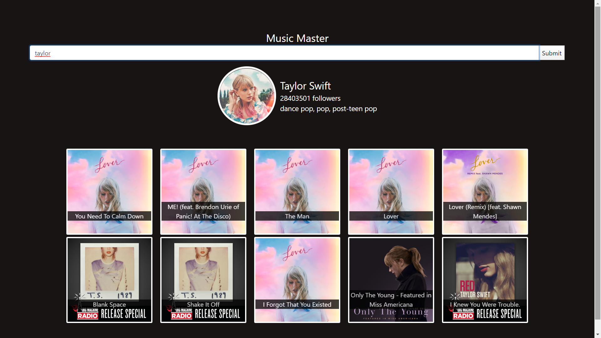

# Spotify Master (Backend)
A web app built with React and Spotify Web API that allows user to search for their favoriate artists and preview the artist's Top 10 albums.

Modified based on [oauth-bridge-template](https://github.com/mpj/oauth-bridge-template)

## Preview


## OAuth bridge template

This service logs in to Spotify and redirects the user to a given frontend application with a valid access_token as a parameter in the url.

## Development mode

In development mode, it assumes you are running the frontend on localhost:3000, but the server itself will be running on localhost:8888.

In order to start developing, register a Spotify Application here:
https://developer.spotify.com/my-applications

On that page, add http://localhost:8888 as a callback url (don't forget to hit save at the bottom of the page)

Write the below commands in your terminal (replacing XXXX AND YYYY with your acutal client id and secret from the page where you registered your application)

```
export SPOTIFY_CLIENT_ID=XXXX
export SPOTIFY_CLIENT_SECRET=YYYY
npm start
```

Then go to http://localhost:8888/login in your browser. This will initiate the login flow and finally redirect to http://localhost:3000?access_token=ZZZZZ where ZZZZZ is a valid access token that you can use to do operations in the Spotify API.

## Deploying to production

This template is indended to be deployed on Heroku. After installing the heroku CLI tools you can run the below commands in the same directory as server.js(replacing abc123, cba456, mybackend and myfrontend with your actual stuff - the below example assume that you already have your frontend running on http://myfrontend.herokuapp.com.

```
heroku create mybackend
heroku config:set SPOTIFY_CLIENT_ID=abc123
heroku config:set SPOTIFY_CLIENT_SECRET=cba456
heroku config:set REDIRECT_URI=https://mybackend.herokuapp.com/callback
heroku config:set FRONTEND_URI=https://myfrontend.herokuapp.com
git push heroku master
```

You should now be able to go to http://mybackend.herokuapp.com/login and it will eventually redirect to http://myfrontend.herokuapp.com?access_token=ZZZZZwhere ZZZZZ is a valid access token that you can use to do operations in the Spotify API.
